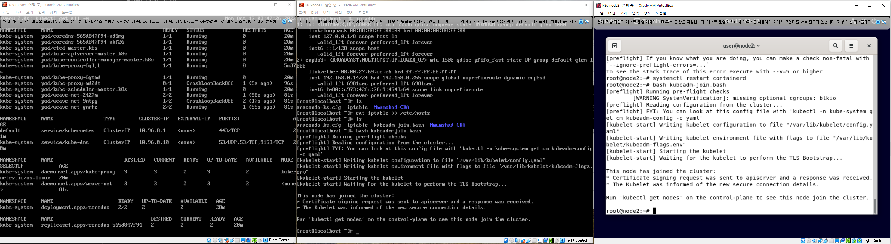
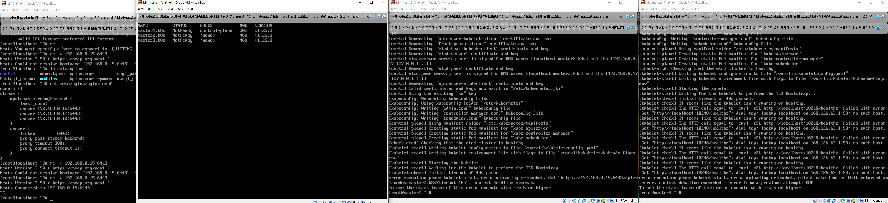

# Configuring K8S Cluster

## 1. Copy this repo
first, you need to clone this repo
```bash
yum install -y git
git clone https://github.com/mod96/Mmumshad-CKA.git
```
or,
```bash
apt-get install -y git
git clone https://github.com/mod96/Mmumshad-CKA.git
```

## 2. Run bash
by running `.bash` file specified prefix by the OS, you'll install `containerd`(cri - docker runtime), `kubelet`, `kubeadm`, `kubectl`, `kubernetes-cni`. (Run this for all nodes & for debian, re-login `su`)

## 3. DNS update
Before doing any further, you need to add DNS records for all nodes. (`/etc/hosts`) For example,
```
192.168.0.9 master.k8s
192.168.0.10 node1.k8s
...
```
* `ip addr`
* you can generate one file in master node and scp to every other nodes
* `hostnamectl --static set-hostname node1.k8s`

## 4. Master Init
Then, for master node, run `kubeadm-init.bash`. (If you want to use multiple control-plane, follow `APPENDIX A`)

## 5. Send kubeadm-join
Then, by using scp, send `kubeadm-join.bash` to all your nodes.
```bash
scp kubeadm-join.bash node1.k8s:/root
```

## 6. Run kubeadm-join on each worker nodes.
Now, run `kubeadm-join.bash` in all of your worker nodes. `kubectl get nodes` in master node will show you if node is well set.

## 7. CNI setup on Master node.
Finally, run `weave-works.bash` in master node.

Below is result with single master(centOS 7), two worker nodes(centOS 7, debian 11)


# APPENDIX A : Setup Multiple ControlPlane

## 1. Copy this repo

## 2. Run LB script on Load Balancing Machine
but this bash needs arguments (specified 3 mater nodes)
```bash
Mmumshad-CKA/bash/LB/redhat-nginx.bash "196.168.0.9" "196.168.0.10" "196.168.0.11"
```

## 3. DNS update

## 4. Master Init
Then, for master node, run `kubeadm-init-multi.bash`. (If you want to use multiple control-plane, follow `APPENDIX A`)

## 5. Send kubeadm-join

## 6. Run kubeadm-join on each sub-master nodes.
## 7. Run kubeadm-join on each worker nodes.
## 8. CNI setup on Master node.



# APPENDIX B : New Token and kubeadm-join.bash
```bash
kubeadm token create > ~/token.txt
```
and run `kubeadm-new-join.bash`.
